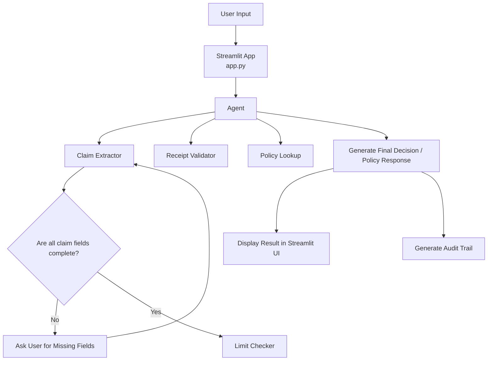

# Travel Reimbursement Approval Assistant

A Streamlit-based assistant that evaluates travel reimbursement claims using an LLM orchestrator plus specialized tools for claim extraction, policy lookup, receipt validation, and limit checking.

## Setup

1. Clone or open this repository.
2. Create a Python virtual environment:
   ```cmd
   python -m venv venv
   venv\scripts\activate
   ```
3. Install dependencies:
   ```cmd
   pip install -r requirements.txt
   ```
4. Create a `.env` file in the project root with your Google API key:
   ```text
   GOOGLE_API_KEY=your_google_api_key_here
   ```

## Required Environment Variables

- `GOOGLE_API_KEY` - required by the Google Gemini models for both embedding generation and chat inference.

## How to Run the Demo

From the project root, run:

```powershell
streamlit run app.py
```

Then open the local Streamlit URL shown in the terminal (typically `http://localhost:8501`).

### Optional: Rebuild the Policy Vector Store

The repo includes a FAISS index under `faiss_index/`. If you need to regenerate it, run:

```powershell
python rag\ingest.py
```

This loads `data/travel_policy.md`, creates embeddings with Google Gemini, and writes a FAISS index to `faiss_index/`.

## Project Structure

- `app.py` — main Streamlit app entry point and UI logic.
- `graph/` — LangGraph workflow orchestration, including agent/tool routing and finalization.
- `prompts/prompts.py` — orchestrator and extraction prompt templates.
- `tools/` — domain-specific tools:
  - `claim_extractor.py` — extracts claim fields from user conversation.
  - `limit_checker.py` — checks expense limits for policy categories.
  - `receipt_validator.py` — validates receipt requirements.
  - `policy_lookup.py` — retrieves relevant policy text from vector search.
- `rag/` — retrieval augmentation code for policy embedding/index management.
- `data/travel_policy.md` — source travel reimbursement policy.
- `faiss_index/` — prebuilt FAISS vector store index.
- `utils/llm.py` — Google Gemini LLM client configuration.
- `models/claim.py` — structured claim schema used for extraction.

## Key Design Choices

- **Streamlit UI** for a lightweight interactive demo that supports chat-style input and structured decision rendering.
- **LLM-orchestrated workflow** via `langgraph` to handle multi-step agent/tool interactions and audit trail generation.
- **Tool decomposition** so the assistant uses specialized components for:
  - claim extraction,
  - policy retrieval,
  - limit checking,
  - receipt validation.
- **Structured claim extraction** using a Pydantic model to enforce required fields and drive follow-up questions.
- **Policy retrieval with FAISS** to surface relevant sections from `travel_policy.md` in support of policy questions.
- **Automatic vector store rebuild** if the FAISS index does not exist, enabling a self-healing retrieval path.

## Flow Diagram

1. User submits a travel expense claim or asks a policy question via the Streamlit interface.
2. The app sends the state to the LangGraph workflow defined in `graph/workflow.py`.
3. The orchestrator in `graph/nodes.py` decides whether to invoke tools or finalize the response.
4. For claims, `claim_extractor` first extracts required fields from the conversation.
5. If the claim is complete, the workflow runs `limit_checker`, `receipt_validator`, and `policy_lookup`.
6. The assistant compiles tool results and returns a structured JSON decision or a policy answer.
7. The final response is shown in Streamlit along with an audit trail of the reasoning steps.



## Usage Notes

- The assistant expects user inputs describing an expense claim or a policy question.
- For claim submissions, the agent first extracts fields, then validates receipts, applies limits, and returns a JSON decision.
- General policy questions trigger a policy lookup instead of a reimbursement decision.

## Troubleshooting

- If the app cannot connect to Google Gemini, confirm `GOOGLE_API_KEY` is set and valid.
- If the FAISS index is missing or outdated, run `python rag\ingest.py` to recreate it.
- If Streamlit fails to start, ensure all requirements are installed in the active virtual environment.
